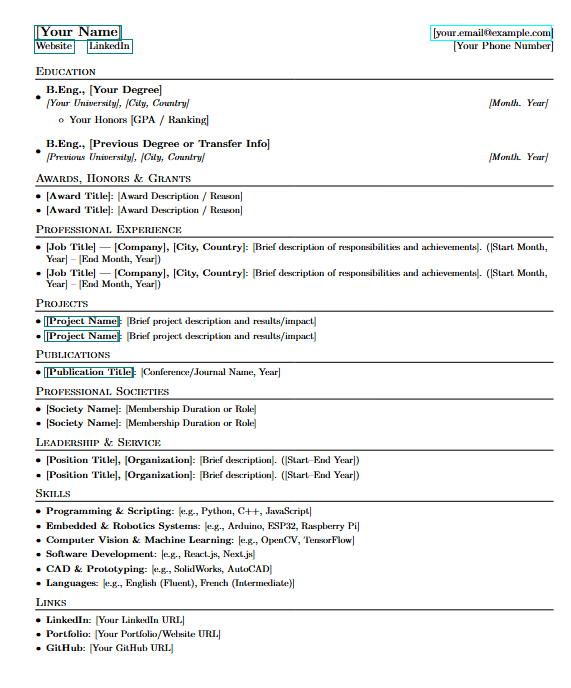

# Professional LaTeX CV Template  
A modern, professional LaTeX CV/Resume template — perfect for academic, research, and industry applications. Works with Overleaf.

📺 **Watch the tutorial:** [How to Create a Professional CV in 5 Minutes!](https://youtu.be/ivFiIMXyOwc)  

---

## 🖼 Preview
<p>
  
</p>

## ✨ Features  
- Professional single-page customizable layout  
- Easy-to-edit sections for Education, Experience, Skills, Awards, and more  
- Optimized for both **academic** and **industry** applications  
- Fully compatible with **Overleaf** and local LaTeX compilers  
- Clean, ATS-friendly design for job applications  

---

## 📂 Files Included  
- `main.tex` – The main LaTeX source file  
- `cv.pdf` – Example generated CV  
- `README.md` – This file  
- `assets/preview.png` – Preview image of the CV  

---

## 🚀 How to Use  

### **Option 1 — Overleaf (Recommended for Beginners)**  
1. Go to [Overleaf](https://www.overleaf.com/)  
2. Click **"New Project" → "Upload Project"**  
3. Upload all files from this repository  
4. Start editing your CV in `main.tex`  

### **Option 2 — Local LaTeX Installation**  
1. Install [TeX Live](https://tug.org/texlive/) (Linux), [MacTeX](https://tug.org/mactex/) (Mac), or [MikTeX](https://miktex.org/) (Windows)  
2. Clone this repo:  
   ```bash
   git clone https://github.com/PAPPY-JOE/professional-latex-cv-template.git
   ```
3. Compile with:
  ```bash
  pdflatex main.tex
  ```

## 📜 License
This template is released under the MIT License — you are free to use, modify, and distribute with attribution.
